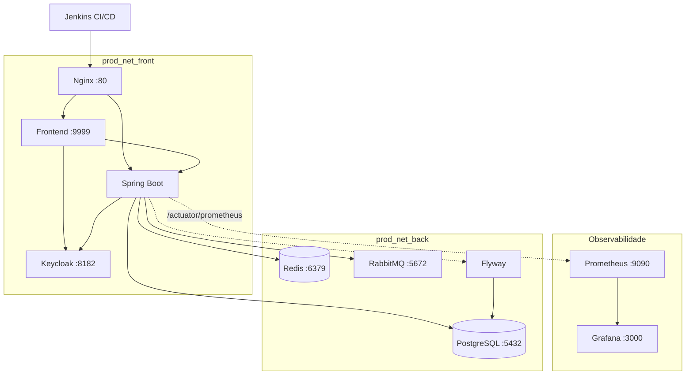

# Tasks Backend

Backend em Spring Boot com infraestrutura DevOps completa: pipeline CI/CD no Jenkins com rollback automatizado, Docker Compose orquestrando 8 serviços, autenticação OAuth2 com Keycloak, mensageria com RabbitMQ, cache com Redis, migrations com Flyway e observabilidade com Prometheus + Grafana.

## Arquitetura



## Stack

| Camada | Tecnologia | Função |
|---|---|---|
| **Backend** | Spring Boot 2.2 / Java 8 | API REST + lógica de negócio |
| **Banco de dados** | PostgreSQL 9.6 | Persistência |
| **Migrations** | Flyway | Versionamento de schema |
| **Cache** | Redis 7.2 | Cache de dados com Spring Cache |
| **Mensageria** | RabbitMQ 3.13 | Auditoria assíncrona de tasks |
| **Autenticação** | Keycloak 23 | OAuth2/JWT Resource Server |
| **Reverse Proxy** | Nginx 1.27 | Roteamento + gzip |
| **Observabilidade** | Prometheus + Grafana | Métricas via Actuator/Micrometer |
| **CI/CD** | Jenkins | Pipeline com deploy e rollback |
| **Containerização** | Docker + Docker Compose | Orquestração de serviços |
| **Testes** | JUnit + Mockito + Testcontainers | Unitários + integração com PostgreSQL real |
| **Cobertura** | JaCoCo | Relatório de cobertura de código |
| **Documentação** | Springdoc OpenAPI | Swagger UI |

## Estrutura do projeto

```
├── Jenkinsfile                  # Pipeline CI/CD (build → test → deploy)
├── Jenkinsfile.rollback         # Pipeline de rollback por versão
├── Dockerfile                   # Imagem Tomcat + WAR
├── docker-compose.yml           # Stack de produção (8 serviços)
├── nginx.conf                   # Reverse proxy config
├── infra/
│   └── observability/
│       ├── docker-compose.yml   # Prometheus + Grafana + Redis + RabbitMQ + Keycloak
│       └── prometheus.yml       # Scrape config do Spring Actuator
├── src/
│   ├── main/
│   │   ├── java/.../taskbackend/
│   │   │   ├── config/          # Security, Cache, RabbitMQ, Swagger
│   │   │   ├── controller/      # REST endpoints
│   │   │   ├── messaging/       # Producer/Consumer de auditoria
│   │   │   ├── model/           # Entidades JPA
│   │   │   └── repo/            # Repositórios Spring Data
│   │   └── resources/
│   │       ├── application.properties
│   │       └── db/migration/    # Flyway migrations
│   └── test/
│       └── java/.../taskbackend/
│           ├── controller/      # Testes unitários (Mockito)
│           ├── repo/            # Testes de integração (Testcontainers)
│           └── utils/           # Testes unitários
└── pom.xml
```

## Pipeline CI/CD (Jenkins)

```
Build Backend → Unit Tests → Deploy Backend (Tomcat)
    → Deploy Frontend → Deploy Prod (Docker Compose)
```

O pipeline principal (`Jenkinsfile`) executa:
1. **Build** — `mvn clean package -DskipTests`
2. **Testes unitários** — `mvn test`
3. **Deploy em staging** — deploy do WAR no Tomcat
4. **Deploy do frontend** — clona, builda e deploya o frontend
5. **Deploy em produção** — `docker-compose build && up -d` com imagens versionadas por `BUILD_NUMBER`

### Rollback

O `Jenkinsfile.rollback` permite reverter para qualquer build anterior:

```
Jenkins → Informar BUILD_NUMBER → Valida imagens Docker → docker-compose up -d
```

Verifica se as imagens `back_prod:build_X` e `front_prod:build_X` existem localmente antes de executar.

## Como rodar

### Pré-requisitos

- Java 8
- Maven 3+
- Docker e Docker Compose

### Ambiente de desenvolvimento

```bash
# Subir serviços de infra (Redis, RabbitMQ, Keycloak, Prometheus, Grafana)
cd infra/observability
docker-compose up -d

# Subir a aplicação
cd ../..
mvn spring-boot:run
```

A aplicação sobe em `http://localhost:8001/tasks-backend`

### Ambiente de produção (Docker Compose)

```bash
export BUILD_NUMBER=1
docker-compose up -d
```

Acesse em `http://localhost` (Nginx roteia para frontend e backend).

### Testes

```bash
# Testes unitários
mvn test

# Testes de integração (Testcontainers - precisa de Docker rodando)
mvn verify

# Relatório de cobertura (gerado em target/site/jacoco)
mvn test jacoco:report
```

## Portas

| Serviço | Dev | Prod |
|---|---|---|
| Backend | 8001 | via Nginx :80 |
| Frontend | — | 9999 / Nginx :80 |
| PostgreSQL | 5433 | 5432 (interno) |
| Redis | 6379 | 6379 |
| RabbitMQ | 5672 / 15672 | 5672 (interno) |
| Keycloak | 8180 | 8182 |
| Prometheus | 9090 | 9090 |
| Grafana | 3000 | 3000 |
| Nginx | — | 80 |
