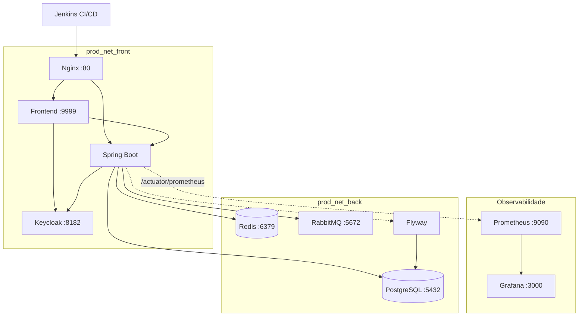

# Tasks Backend

Backend em Spring Boot com infraestrutura DevOps completa: pipeline CI/CD no Jenkins com rollback automatizado, Docker Compose orquestrando 8 serviços, autenticação OAuth2 com Keycloak, mensageria com RabbitMQ, cache com Redis, migrations com Flyway e observabilidade com Prometheus + Grafana.

## Arquitetura



## Stack

| Camada | Tecnologia | Função |
|---|---|---|
| **Backend** | Spring Boot 2.2 / Java 8 | API REST + lógica de negócio |
| **Banco de dados** | PostgreSQL 9.6 | Persistência |
| **Migrations** | Flyway | Versionamento de schema |
| **Cache** | Redis 7.2 | Cache de dados com Spring Cache |
| **Mensageria** | RabbitMQ 3.13 | Auditoria assíncrona de tasks |
| **Autenticação** | Keycloak 23 | OAuth2/JWT Resource Server |
| **Reverse Proxy** | Nginx 1.27 | Roteamento + gzip |
| **Observabilidade** | Prometheus + Grafana | Métricas via Actuator/Micrometer |
| **CI/CD** | Jenkins | Pipeline com deploy e rollback |
| **Containerização** | Docker + Docker Compose | Orquestração de serviços |
| **Testes** | JUnit + Mockito + Testcontainers | Unitários + integração com PostgreSQL real |
| **Cobertura** | JaCoCo | Relatório de cobertura de código |
| **Documentação** | Springdoc OpenAPI | Swagger UI |

## Estrutura do projeto

```
├── Jenkinsfile                  # Pipeline CI/CD (build → test → deploy)
├── Jenkinsfile.rollback         # Pipeline de rollback por versão
├── Dockerfile                   # Imagem Tomcat + WAR
├── docker-compose.yml           # Stack de produção (8 serviços)
├── nginx.conf                   # Reverse proxy config
├── infra/
│   └── observability/
│       ├── docker-compose.yml   # Prometheus + Grafana + Redis + RabbitMQ + Keycloak
│       └── prometheus.yml       # Scrape config do Spring Actuator
├── src/
│   ├── main/
│   │   ├── java/.../taskbackend/
│   │   │   ├── config/          # Security, Cache, RabbitMQ, Swagger
│   │   │   ├── controller/      # REST endpoints
│   │   │   ├── messaging/       # Producer/Consumer de auditoria
│   │   │   ├── model/           # Entidades JPA
│   │   │   └── repo/            # Repositórios Spring Data
│   │   └── resources/
│   │       ├── application.properties
│   │       └── db/migration/    # Flyway migrations
│   └── test/
│       └── java/.../taskbackend/
│           ├── controller/      # Testes unitários (Mockito)
│           ├── repo/            # Testes de integração (Testcontainers)
│           └── utils/           # Testes unitários
└── pom.xml
```

## Pipeline CI/CD (Jenkins)

```
Build Backend → Unit Tests → Deploy Backend (Tomcat)
    → Deploy Frontend → Deploy Prod (Docker Compose)
```

O pipeline principal (`Jenkinsfile`) executa:
1. **Build** — `mvn clean package -DskipTests`
2. **Testes unitários** — `mvn test`
3. **Deploy em staging** — deploy do WAR no Tomcat
4. **Deploy do frontend** — clona, builda e deploya o frontend
5. **Deploy em produção** — `docker-compose build && up -d` com imagens versionadas por `BUILD_NUMBER`

### Rollback

O `Jenkinsfile.rollback` permite reverter para qualquer build anterior:

```
Jenkins → Informar BUILD_NUMBER → Valida imagens Docker → docker-compose up -d
```

Verifica se as imagens `back_prod:build_X` e `front_prod:build_X` existem localmente antes de executar.

## Como rodar

### Pré-requisitos

- Java 8
- Maven 3+
- Docker e Docker Compose

### Ambiente de desenvolvimento

```bash
# Subir serviços de infra (Redis, RabbitMQ, Keycloak, Prometheus, Grafana)
cd infra/observability
docker-compose up -d

# Subir a aplicação
cd ../..
mvn spring-boot:run
```

A aplicação sobe em `http://localhost:8001/tasks-backend`

### Ambiente de produção (Docker Compose)

```bash
export BUILD_NUMBER=1
docker-compose up -d
```

Acesse em `http://localhost` (Nginx roteia para frontend e backend).

### Testes

```bash
# Testes unitários
mvn test

# Testes de integração (Testcontainers - precisa de Docker rodando)
mvn verify

# Relatório de cobertura (gerado em target/site/jacoco)
mvn test jacoco:report
```

## Portas

| Serviço | Dev | Prod |
|---|---|---|
| Jenkins | 8000 | — |
| Tomcat | 8001 | — |
| Backend | 8001 | via Nginx :80 |
| Frontend | — | 9999 / Nginx :80 |
| PostgreSQL | 5433 | 5432 (interno) |
| Redis | 6379 | 6379 |
| RabbitMQ | 5672 / 15672 | 5672 (interno) |
| Keycloak | 8180 | 8182 |
| Prometheus | 9090 | 9090 |
| Grafana | 3000 | 3000 |
| Nginx | — | 80 |

---

## Guia completo do laboratório

Passo a passo para subir o ambiente completo do zero.

### 1. Abrir o Docker Desktop

O Docker Desktop precisa estar rodando antes de qualquer outro passo.

Para liberar memória do WSL caso esteja pesando o ambiente:

```bash
wsl --shutdown
```

### 2. Subir o Jenkins

```bash
java -jar jenkins.war --httpPort=8000
```

Acesse em `http://localhost:8000`

### 3. Subir o Tomcat

Acesse a pasta `bin/` do Tomcat e execute o `startup.sh` (Linux/Mac) ou `startup.bat` (Windows).

Após subir, acesse `http://localhost:8001`

### 4. Subir a infraestrutura (dev)

```bash
cd infra/observability
docker compose up -d
```

Isso sobe: **Prometheus**, **Grafana**, **Redis**, **RabbitMQ** e **Keycloak** (dev).

Se o PostgreSQL de dev não subir junto, inicie manualmente:

```bash
docker start pg-tasks
```

### 5. Rodar o pipeline

No Jenkins (`http://localhost:8000`), acesse o job **Pipeline** e clique em **Build Now**.

O pipeline executa automaticamente:
1. Build do backend (`mvn clean package`)
2. Testes unitários (`mvn test`)
3. Deploy do WAR no Tomcat
4. Clone e deploy do frontend
5. `docker-compose build && up -d` (produção)

### 6. Acessar a aplicação

| Ambiente | URL |
|---|---|
| **Prod (com Nginx)** | `http://localhost/tasks/` |
| **Prod (sem Nginx)** | `http://localhost:9999/tasks/` |
| **Dev (Tomcat)** | `http://localhost:8001/tasks-backend` |

### Subir uma versão já buildada (sem rodar o pipeline)

Para subir rapidamente uma versão que já foi buildada anteriormente:

```bash
cd ~/.jenkins/workspace/Pipeline
BUILD_NUMBER=<numero_do_build> docker compose up -d
```

### Reiniciar containers de produção

Se algum container caiu, reinicie na ordem correta:

```bash
# Primeiro os serviços base, depois o backend, e por último frontend e nginx
docker start pg-prod rabbitmq-prod keycloak-prod
sleep 5
docker start backend-prod
sleep 5
docker start frontend-prod nginx-prod
```

> **Nota:** O Nginx depende do frontend/backend já existirem na rede. Se ele reclamar de `host not found in upstream`, um `docker restart nginx-prod` resolve.

### Verificar versão em produção

```bash
docker inspect backend-prod --format "{{.Config.Image}}"
docker inspect frontend-prod --format "{{.Config.Image}}"
```

---

## Configuração do Keycloak

O Keycloak gerencia autenticação OAuth2/JWT. O fluxo de login:

```
Acessa localhost/tasks → Redireciona para Keycloak → Login
→ Keycloak gera JWT → Redireciona de volta → Frontend usa JWT para chamar o backend
→ Backend valida JWT → Retorna dados
```

| Ambiente | URL |
|---|---|
| Dev | `http://localhost:8180` |
| Prod | `http://localhost:8182` |

### Configurar o realm (necessário na primeira vez)

1. **Criar o Realm** — Menu superior esquerdo → Create realm → Nome: `tasks-realm`
2. **Criar o Client** — Clients → Create client → Client ID: `tasks-frontend` → Client authentication: OFF → Valid redirect URIs: `http://localhost:9999/tasks/*` → Web origins: `http://localhost:9999`
3. **Criar um usuário** — Users → Add user → Definir username → Aba Credentials → Set password → Temporary: OFF

---

## Observabilidade

### Endpoints do Actuator

| Endpoint | URL |
|---|---|
| Health | `http://localhost:8001/tasks-backend/actuator/health` |
| Metrics | `http://localhost:8001/tasks-backend/actuator/metrics` |
| Prometheus | `http://localhost:8001/tasks-backend/actuator/prometheus` |

### Prometheus

Acesse `http://localhost:9090`

O scrape está configurado em `infra/observability/prometheus.yml` para coletar métricas do Spring Actuator.

### Grafana

Acesse `http://localhost:3000`

**Configurar data source:** Connections → Data Sources → Add Data Source → Prometheus → URL: `http://prometheus:9090`

Exemplo de query: `sum(jvm_memory_max_bytes)`

---

## Swagger

| Recurso | URL |
|---|---|
| Swagger UI | `http://localhost:8001/tasks-backend/swagger-ui.html` |
| API Docs (JSON) | `http://localhost:8001/tasks-backend/v3/api-docs` |

---

## Redis (CLI)

```bash
# Conectar no container
docker exec -it redis redis-cli

# Listar chaves gravadas pelo Spring Cache
keys *

# Ver o valor de uma chave
get courses::"java"
```

---

## RabbitMQ

Painel de administração: `http://localhost:15672`

### Publicar evento de auditoria manualmente

Payload:
```json
{
  "action": "TASK_CREATED",
  "taskId": 999,
  "taskDescription": "Task publicada pelo painel",
  "occurredAt": "2026-06-03T20:00:00"
}
```

Header obrigatório:
```
__TypeId__ = br.ce.wcaquino.taskbackend.messaging.TaskAuditEvent
```

Consultar logs de auditoria no banco:
```sql
SELECT id, action, task_id, task_description, occurred_at
FROM audit_log ORDER BY occurred_at DESC;
```

---

## Testes de integração (Testcontainers)

Precisa do Docker rodando. O Testcontainers sobe um PostgreSQL descartável automaticamente:

```bash
mvn verify
```

---

## Selenium Grid (para testes funcionais)

```bash
# Subir o Hub
java -jar selenium-server-standalone-3.141.59.jar -role hub

# Subir um Node (em outro terminal)
java -jar selenium-server-standalone-3.141.59.jar -role node -hub http://localhost:4444

# Abrir mais nodes: repetir o comando acima em novos terminais
```

Console do Grid: `http://localhost:4444/console`

---

## Repositórios relacionados

| Repositório | Descrição |
|---|---|
| [tasks-backend](https://github.com/josuejorge/tasks-backend) | Backend Spring Boot |
| [tasks-frontend](https://github.com/josuejorge/tasks-frontend) | Frontend Thymeleaf |
| [tasks-api-test](https://github.com/josuejorge/tasks-api-test) | Testes automatizados de API |
| [tasks-functional-tests](https://github.com/josuejorge/tasks-functional-tests) | Testes funcionais E2E (Selenium)